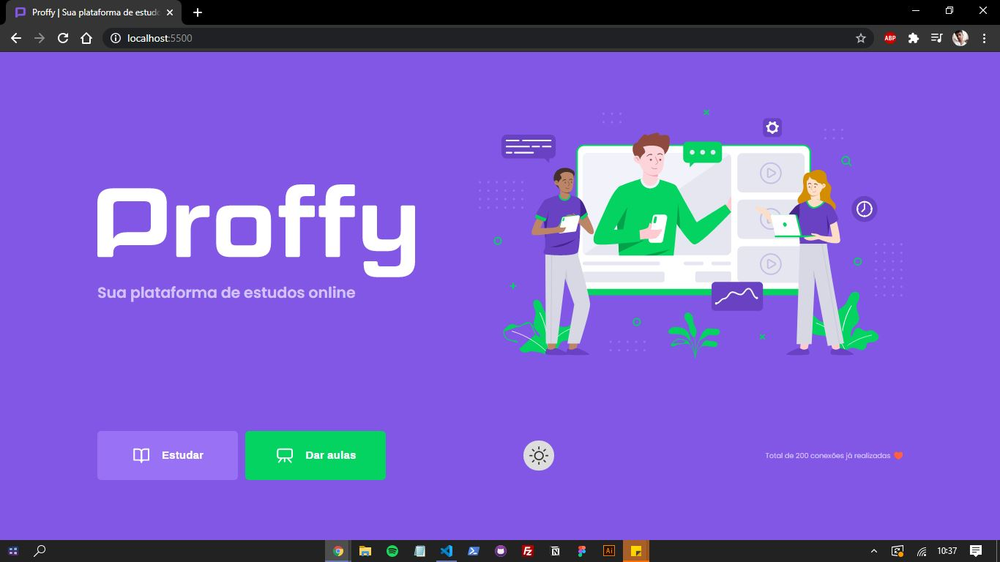
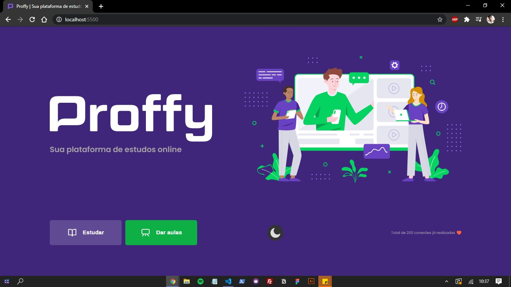
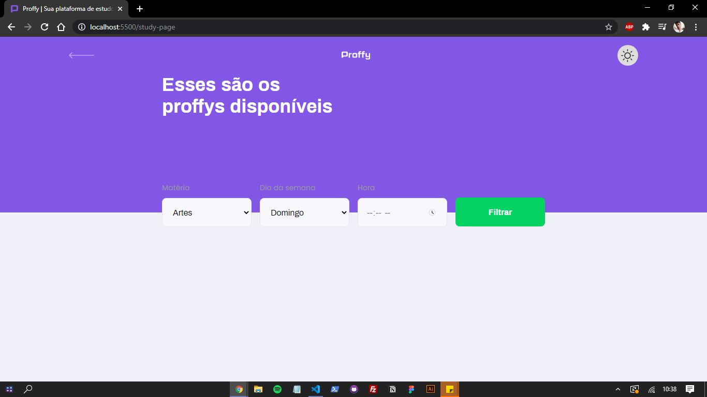
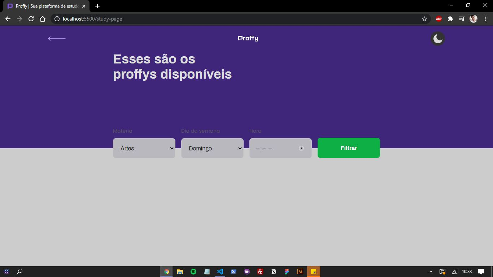
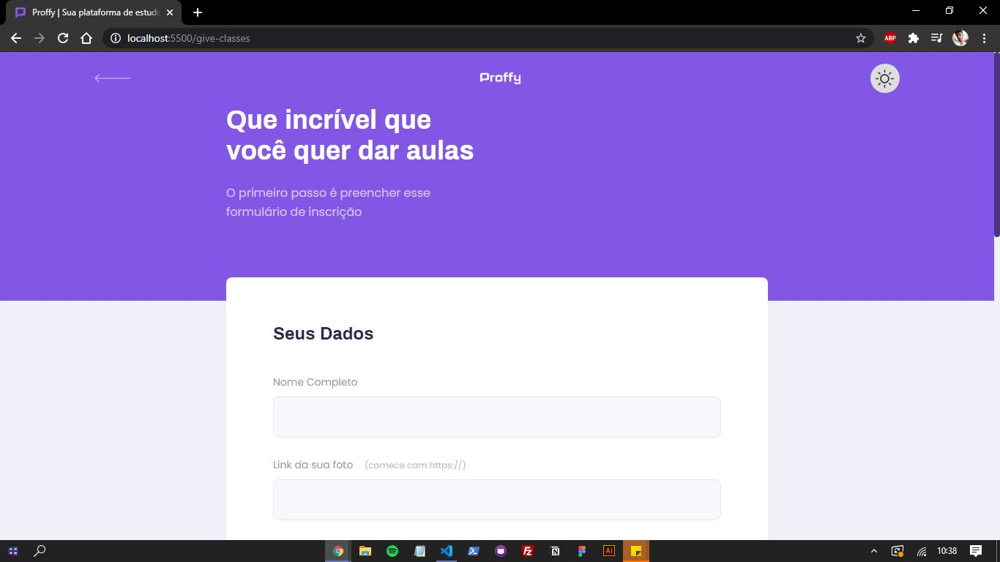
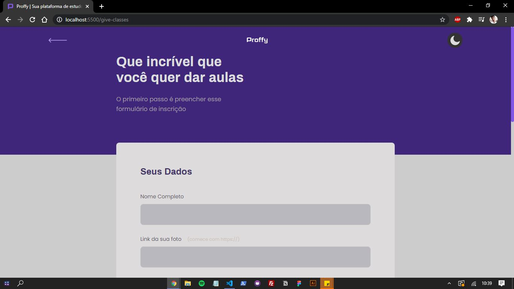

<h1 align="center">Proffy<h1>

## Descrição ✍️

  Plataforma de estudos online desenvolvida na next level week. Os professores podem se cadastrar utilizando o formulário e eles ficarão gravados no banco de dados onde os alunos podem procurar por matéria e dia e horário.

&nbsp;

  
  
  
  
  
  

 <a href="#objetivo">Objetivo</a> •
 <a href="#tecnologias">Tecnologias</a> •
 <a href="#features">Features</a> •
 <a href="#run">Run</a> •
 <a href="#autor">Autor</a>

## Objetivo 🚀

   Utilizamos o conceito de mobile first para desenvolver essa plataforma, usamos também o css grid para organizar todo o conteudo e fizemos a junção do banco de dados com o backend e o frontend.

&nbsp;
## Tecnologias 👩‍💻

 
 - HTML
 &nbsp;
 - CSS
 &nbsp;
 - JS
 &nbsp;
 - Express.js
 &nbsp;
 - Nodemon
 &nbsp;
 - Nunjucks
 &nbsp;
 - SQlite

&nbsp;
## Features 🆕

  ✅ Dark mode
  &nbsp;

  ✅ Filtro de professores
  &nbsp;

  ✅ Multiplos horários disponíveis na hora do cadastro
  &nbsp;

  ✅ Site Responsivo

&nbsp;
## Run 🏁

  1º Para rodar o projeto é necessário instalar todas as dependências, e para isso basta executar o comando `npm install`.
  &nbsp;

  2º Afim de iniciar o servidor, após instalar as depencências, execute o comando `yarn dev` no terminal.
  &nbsp;

  3º Após isso, no seu navegador, abra o endereço `http://localhost:5500/` para vizualizar o prjeto.

&nbsp;
## Autor
<a style="text-decoration: none;" href="https://github.com/olagregs">
  
  
Gregory Ferreira 💻

</a>

Made with ❤️ and ☕ by me 😁

&nbsp;